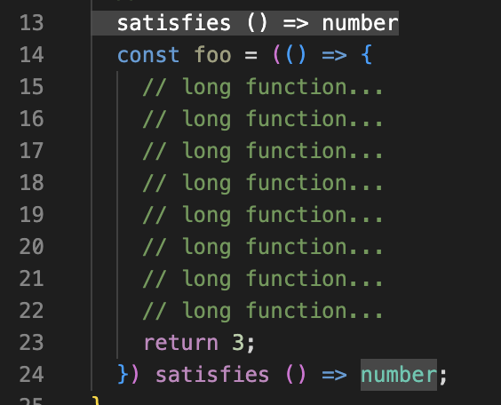

# ts-satisfies-plugin

A TypeScript Language Service Plugin that satisfies you.



This plugin provides inlay hints for expressions constrained by the `satisfies` syntax.

This is especially helpful when a function has a `satisfies` constraint. With this plugin, an inlay hint for the `satisfies` constraint is shown right above its declaration.

You often want to see other function interface and `satisfies` constraint at the same time. This plugin is here fore you.

## Installation

Install with your package manager.

```sh
npm i -D ts-satisfies-plugin
```

Add this plugin to your `tsconfig.json`.

```json
{
  "compilerOptions": {
    // ...
    "plugins": [
      {
        "name": "ts-satisfies-plugin"
      }
    ]
  }
}
```

## Options

### `minLines`: number

```json
"plugins": [
  {
    "name": "ts-satisfies-plugin",
    "minLines": 3
  }
]
```

Minimum number of lines occupied by an expression in order for an inlay hint to appear.

Default value: 1 (inlay hints shown to all `satisfies`-constrained expressions)

# License

MIT


